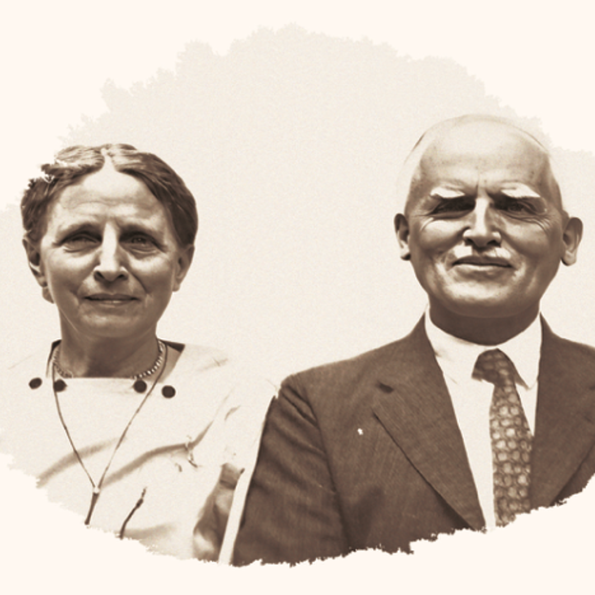
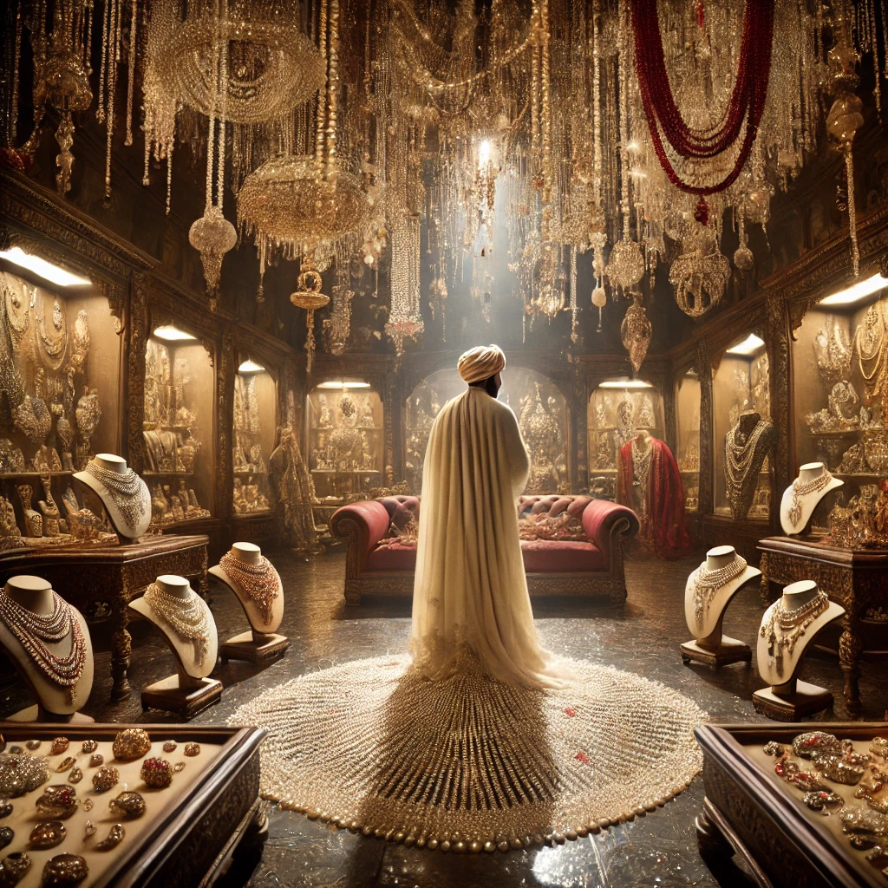
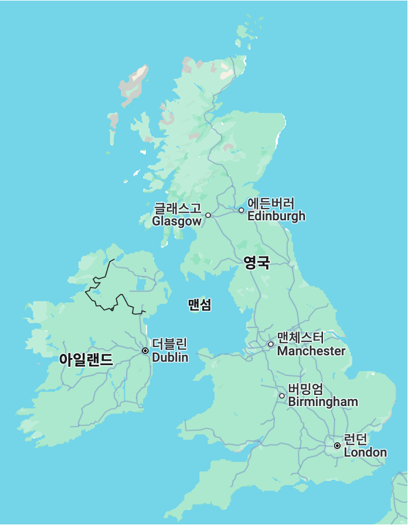
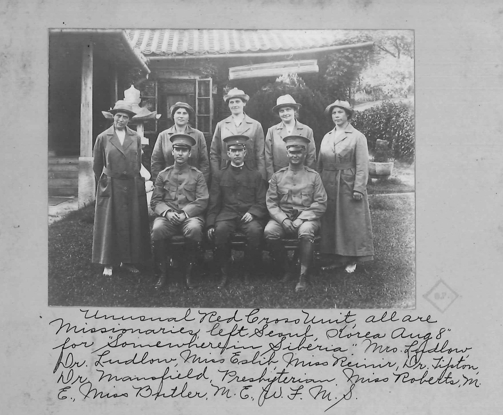
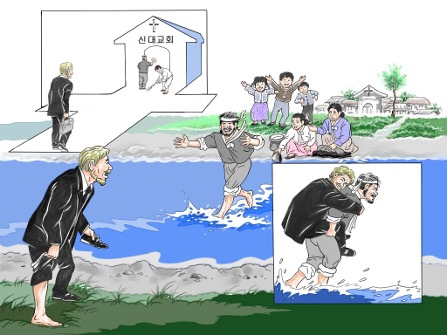
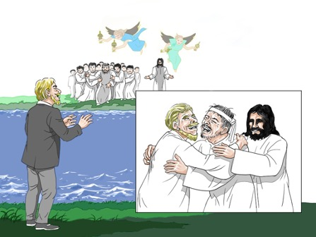

---
# :w | !pandoc %:r.md -s -t revealjs -o %:r.html
# :!open %:r.html
# 
title: '충북선교현장을'
subtitle: '통해서 본 청주선교부의 사역'
date: '2024. 10. 14.'
author: '이원식'
output:
  revealjs::revealjs_presentation:
    css: 'styles.css'
    self_contained: 'true'
    highlight: 'tango'
    incremental: 'true'
background-transition: 'slide'
center: 'true'
slideNumber: 'true'
previewLinks: 'true'
theme: 'moon'  # league dracula blood black white sky beige simple serif night solarize
transition: 'fade'
---
# 0. 서론


<style>
#bright {color: deeppink; }
</style>

<style>
#dark {color: limegreen; }
</style>

<style>
#choco {color: chocolate; }
</style>

<style>
#salmon {color: salmon; }
</style>
<!-- 칼라 사용하기 -->

<!--
<section>
- <span id='deeppink'>Deep Pink</span></section>

<section>
- <span id='dark'>Dark</span>
</section>

<section>
- <span id='choco'>Chocolate</span>
- <span id='salmon'>Salmon</span>
</section>
-->

```
충북선교현장에선 211편, 소제목을 별도로 하면 268편의 글이 수록되어 있다.
발표할 글의 순서는 다음과 같다.

```

<span class="fragment">민노아 &nbsp; </span>
<span class="fragment">헌트  &nbsp;</span>
<span class="fragment">카긴 &nbsp;</span>
<span class="fragment">솔타우 &nbsp; </span>
<span class="fragment">팁톤</span>

<span class="fragment">결론</span>

---

# 발표 편 수

<canvas id="myBarChart" width="1000" height="450"></canvas> <!-- Increased height to 800px -->

<script src="https://cdn.jsdelivr.net/npm/chart.js"></script>
<script>

  var ctx = document.getElementById('myBarChart').getContext('2d');
  var myBarChart = new Chart(ctx, {
    type: 'bar',
    data: {
      labels: ['민노아', '클락', '무명', '헌트', '카긴', '솔타우', '도티', '쉴즈', '데이비스', '스워러', '퍼비안스', '룰루 퍼비안스', '쿡', '모리스', '에비슨', '에스텝', '팁톤', '해리 로즈', 'E. H. 밀러'],
      datasets: [{
        label: '편 수',
        data: [122, 24, 14, 10, 7, 7, 6, 6, 3, 3, 3, 3, 3, 3, 1, 1, 1, 1, 1],
        backgroundColor: [
          'rgba(255, 99, 132, 0.6)',  // Red
          'rgba(54, 162, 235, 0.6)',  // Blue
          'rgba(75, 192, 192, 0.6)',  // Teal
          'rgba(255, 206, 86, 0.6)',  // Yellow
          'rgba(153, 102, 255, 0.6)', // Purple
          'rgba(255, 159, 64, 0.6)',  // Orange
          'rgba(255, 99, 132, 0.6)',  // Red
          'rgba(54, 162, 235, 0.6)',  // Blue
          'rgba(75, 192, 192, 0.6)',  // Teal
          'rgba(255, 206, 86, 0.6)',  // Yellow
          'rgba(153, 102, 255, 0.6)', // Purple
          'rgba(255, 159, 64, 0.6)',  // Orange
          'rgba(255, 99, 132, 0.6)',  // Red
          'rgba(54, 162, 235, 0.6)',  // Blue
          'rgba(75, 192, 192, 0.6)',  // Teal
          'rgba(255, 206, 86, 0.6)',  // Yellow
          'rgba(153, 102, 255, 0.6)', // Purple
          'rgba(255, 159, 64, 0.6)',  // Orange
          'rgba(255, 99, 132, 0.6)'   // Red
        ],
        borderColor: [
          'rgba(255, 99, 132, 1)',    // Red
          'rgba(54, 162, 235, 1)',    // Blue
          'rgba(75, 192, 192, 1)',    // Teal
          'rgba(255, 206, 86, 1)',    // Yellow
          'rgba(153, 102, 255, 1)',   // Purple
          'rgba(255, 159, 64, 1)',    // Orange
          'rgba(255, 99, 132, 1)',    // Red
          'rgba(54, 162, 235, 1)',    // Blue
          'rgba(75, 192, 192, 1)',    // Teal
          'rgba(255, 206, 86, 1)',    // Yellow
          'rgba(153, 102, 255, 1)',   // Purple
          'rgba(255, 159, 64, 1)',    // Orange
          'rgba(255, 99, 132, 1)',    // Red
          'rgba(54, 162, 235, 1)',    // Blue
          'rgba(75, 192, 192, 1)',    // Teal
          'rgba(255, 206, 86, 1)',    // Yellow
          'rgba(153, 102, 255, 1)',   // Purple
          'rgba(255, 159, 64, 1)',    // Orange
          'rgba(255, 99, 132, 1)'     // Red
        ],
        borderWidth: 1
      }]
    },
    options: {
      indexAxis: 'y',  // This makes it horizontal
      scales: {
        x: {
          beginAtZero: true
        },
        y: {
          ticks: {
            autoSkip: false  // Ensure that all labels are displayed
          }
        }
      }
    }
  });
</script>

---

# 1. 민노아

---



```
                     민노아 선교사와 수잔 도티 여사
```

---

# &nbsp; {data-background='feynmann.png'}

---

```
                    a.  한국적인 것들 : 1916. 11.
```


<div style="display: flex; justify-content: space-between;">

  <div style="width: 50%; text-align: center;">
  
  </div>

  <div style="width: 50%; text-align: center;">
  
  </div>

</div>

---

```
                    b. 술집 주인의 아들 : 1931. 1. 
```

<div style="display: flex; justify-content: space-between;">

  <div style="width: 50%; text-align: center;">
  
  </div>

  <div style="width: 50%; text-align: center;">
  
  </div>

</div>

---

#### &nbsp;

``` 
                     c. 선교의 어려움: 1902. 2.
```


---

#### &nbsp;

```
                          d. 민노아의 가족 
```



```
"소년들은 교사의 아일랜드 사투리를 너무나 잘 배우고 호의적이어서 나는 교사로서 우월감이 생겼습니다."
```

---

# 2. 헌트

* 소년의 회상 : 1919. 8.

```
특히 토요일 아침이 가장 싫었습니다. 남자 아이들은 책을 먼지를 털어내야 했고, 여자 아이들은 바느질을 했으며, 모두 집에 편지를 써야 했습니다. 저는 보통 즐기지 않았습니다. 책의 먼지를 털다가 소파에 발을 올려놓았던 그 토요일도 기억납니다. 그때 저는 크기가 작은 구판 『한국선교현장』으로 엉덩이를 찰싹 맞았습니다....  

주님의 뜻이라면 저는 주님을 위한 목사가 될 것이며, 저를 위해 해주신 모든 일에 대해 여러분께 감사드립니다.
```

---


```
                 1958. 3. 21.  부산 고려신학교 졸업
```
---

# 3. 카긴

- 절제 : 1917. 9.

```
통제되지 않은 사랑은 한편으로는 저급한 욕망으로, 다른 한편으로는 단순한 친절이나 과장된 감정 분출이라는 쪽으로 타락될 수 있습니다....   

균형 잡힌 사람은 덕목이 그 경계를 넘어 발전해 나가지 않도록 하고, 필요한 견제 없이 두지 않도록 황금절충(Golden mean)을 지키는 사람입니다.... 

예수님은 그런 균형 잡힌 분이셨습니다. 그는 사랑에 대한 큰 능력을 가지고 있었고, 잘못된 것은 훌륭하게 증오하실 수 있으셨습니다. 
```

---


```
         미네소타 성바울의 Macalester 대학 종교학과 교수로 재직함
```

---

# 4. 솔타우

- 추위와 더위 : 1918. 8.

```
첫 이틀 동안 우리가 이동한 길은 전형적인 산길로, 불가능해 보이는 언덕을 지그재그와 말굽 모양의 곡선을 그리며 기어오르거나 가파른 좁은 골짜기를 따라 내려갔습니다. 몇 달 전에 내린 눈이 큰 나무 썰매에 의해 단단하고 매끄럽게 다져져 있었습니다.... 

이는 아마도 잘못 인도된 선교사를 끌고 다니는 불편함을 견디기보다 집으로 돌아가라고 썰매가 조랑말에게 보내는 신호였을 것입니다. 선교사는 담요에 따뜻하게 싸여 반쯤 잠든 상태로 자연의 아름다움이나 조랑말 발아래의 눈이 뽀삭거리는 소리에 무감각해졌습니다.... 

이틀 동안 산을 넘고 나서 우리는 완전히 얼어붙은 깊이 약 3피트의 압록강으로 나왔습니다.
```

---


```
                     솔타우 목사, 데오도라, 엘리너 박사
```

---


# 5. 팁톤

- “왜 한국에 선교사로 가려고 하십니까?” : 1916. 7.

```
그분은 “너희가 나를 사랑하면 내 계명을 지키라”고 하셨습니다. 그렇다면 그분이 한국에서 나를 필요로 하실 때, 제가 미국에 남아서 그분을 사랑한다고 할 수 있을까요?.... 

미국에는 500~600명당 한 명의 의사가 있습니다. 뉴욕의 한 거리에서는 한 블록에 72명의 의사가 사무실을 두고 있는 것을 세어본 적이 있습니다! 반면, 한국에서 제가 담당하는 지역에는 인구가 30만 명인 도시에 20개의 병상을 가진 작은 병원이 단 두 개뿐입니다. 
```

---



```
             적십자 복장을 하고 가운데 앉아 있는 분이 팁톤 박사
```
---

# 6. 결론

---

# 한국! 나의 고향

<br>

```
                오, 고귀한 산들과 
                넓고 풍요로운 평야의 땅, 
                타오르는 황금빛 햇살과 
                맑고 깨끗한 수정 같은 비, 
                새벽에 이는 진주 같은 안개, 
                하루 종일 반짝이는 초록빛, 
                장밋빛과 노란색의 석양, 
                별빛이 빛나는 밤들. 

```

---

# 한국! 나의 고향

<br>

```
                오, 새로운 땅과 새로운 하늘! 
                더 아름다울 필요가 없네, 
                자유로운 바람마다 
                하나님의 자유가 숨쉬고; 
                믿음이 바위산처럼 
                언제나 하늘을 가리키고, 
                하늘의 사랑이 햇살처럼 
                영광의 홍수로 깔리네. 
```

---

# 한국! 나의 고향

<br>

```
                오, 고향이여, 나는 너를 사랑하네 
                하나님의 아름다움으로 차려입고! 
                오, 고향이여, 나는 꿈꾸네 
                하나님의 영광으로 축복받은 너를! 
                오! 공의의 태양이여 떠오르라, 
                치유의 날개를 가지고! 
                하나님의 완전한 평화를 
                우리의 고요한 아침의 나라에 가져다주기를!

```

---

<div style="display: flex; justify-content: space-between;">

  <div style="width: 50%; text-align: center;">
  
  </div>

  <div style="width: 50%; text-align: center;">
  
  </div>

</div>

```
"우리 한국 농부들은 논 위에 얼음이 깔려 있을 때 일하는 것에 익숙하지만 목사님은 그렇지 않습니다. 어서 제 등에 업히세요." 이것은 순전한 그의 나드 향유 옥합이었으니, 누가 그것을 거절할 수 있었겠습니까?....  

그리운 윤씨 할아버지는 이제 저보다 먼저 세상을 떠나가셨습니다. 저도 마침내 요단강 둑을 내려가게 되면, 윤씨 할아버지가 이렇게 부르시는 음성을 들게 될 것 같습니다. "목사님, 신발 벋지 마세요. 제가 곧장 그리로 갈께요".
```

<!--
<script>
window.onload = function() {
  Reveal.initialize({
    parallaxBackgroundImage: 'parallax.tiff',
    parallaxBackgroundSize: '2100px 900px',
    parallaxBackgroundHorizontal: 200,
    parallaxBackgroundVertical: 50
  });
};
</script>
-->
